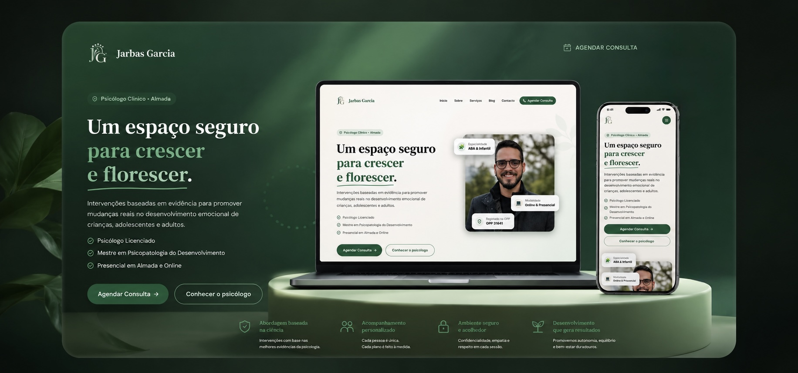

<div align="center">

  

  <br/>
  <br/>

  <h1>🧠 Jarbas Garcia — Psicólogo Clínico em Almada</h1>

  <p>Site institucional moderno e responsivo desenvolvido para psicólogo clínico especializado em ABA, psicologia infantil, ansiedade e treino parental. Construído com foco em performance, SEO e experiência do utilizador.</p>

  <br/>

  
  
  
  

  <br/>

  [🌐 Ver Site ao Vivo](https://www.psijarbas.pt) &nbsp;·&nbsp; [📋 Reportar Bug](https://github.com/jacksonangelo24/projeto-jarbas/issues)

</div>

---

## ✨ Funcionalidades

- **Landing page completa** com secções Hero, Problemas, Serviços, Sobre, Especialidades, Depoimentos e CTA
- **Múltiplas páginas** — Início, Sobre, Serviços, Blog e Contacto
- **SEO otimizado** — metadata, Open Graph, Twitter Card e canonical URLs configurados
- **Botão flutuante de WhatsApp** — facilitando o contacto direto
- **Animações suaves** — fade-up, fade-in e float com Intersection Observer
- **Design responsivo** — mobile-first, adaptado a todos os tamanhos de ecrã
- **Tipografia premium** — Inter (body) + Playfair Display (títulos)
- **Paleta de cores personalizada** — verde, bege e sage harmoniosos e profissionais

---

## 🗂️ Páginas

| Página | Rota | Descrição |
|---|---|---|
| Início | `/` | Hero, Serviços, Sobre, Depoimentos e CTA |
| Sobre | `/sobre` | Percurso e filosofia do psicólogo |
| Serviços | `/servicos` | Detalhe de cada serviço oferecido |
| Blog | `/blog` | Artigos e conteúdo educativo |
| Contacto | `/contato` | Formulário de contacto e localização |

---

## 🛠️ Stack Tecnológica

| Tecnologia | Versão | Uso |
|---|---|---|
| [Next.js](https://nextjs.org/) | 15.3.1 | Framework (App Router) |
| [React](https://react.dev/) | 19 | UI |
| [TypeScript](https://www.typescriptlang.org/) | 5 | Tipagem estática |
| [Tailwind CSS](https://tailwindcss.com/) | 3.4 | Estilização |
| [Lucide React](https://lucide.dev/) | 0.511 | Ícones |
| [Google Fonts](https://fonts.google.com/) | — | Inter + Playfair Display |

---

## 📁 Estrutura do Projeto

```
src/
├── app/                    # App Router do Next.js
│   ├── page.tsx            # Página principal
│   ├── layout.tsx          # Layout global (Header, Footer, WhatsApp)
│   ├── sobre/              # Página Sobre
│   ├── servicos/           # Página Serviços
│   ├── blog/               # Página Blog
│   └── contato/            # Página Contacto
├── components/
│   ├── layout/             # Header e Footer
│   ├── sections/           # Secções da landing page
│   └── ui/                 # Componentes reutilizáveis (Button, Reveal, WhatsApp)
├── hooks/
│   └── useInView.ts        # Hook para animações ao scroll
└── lib/
    ├── constants.ts        # Dados do site (serviços, links, contactos)
    └── utils.ts            # Utilitários
```

---

## 🚀 Como Executar Localmente

```bash
# 1. Clone o repositório
git clone https://github.com/jacksonangelo24/projeto-jarbas.git
cd projeto-jarbas

# 2. Instale as dependências
npm install

# 3. Inicie o servidor de desenvolvimento
npm run dev
```

Aceda a **http://localhost:3000** no seu browser.

### Scripts disponíveis

```bash
npm run dev      # Servidor de desenvolvimento
npm run build    # Build de produção
npm run start    # Servidor de produção
npm run lint     # Linting com ESLint
```

---

## 🎨 Sistema de Design

### Paleta de Cores

| Token | Valor | Uso |
|---|---|---|
| `green-500` | `#3a9e78` | Cor principal, CTAs |
| `sage` | `#5B8F78` | Acentos e elementos secundários |
| `beige-100` | `#faf7f2` | Fundos de secções alternadas |

### Animações

| Animação | Duração | Aplicação |
|---|---|---|
| `fade-up` | 0.6s | Entradas de conteúdo ao scroll |
| `fade-in` | 0.5s | Revelações suaves |
| `float` | 3s (loop) | Elementos decorativos |
| `pulse-slow` | 3s (loop) | Indicadores de destaque |

---

## 📞 Sobre o Cliente

**Jarbas Garcia** — Psicólogo clínico com registo **OPP 31641**, sediado em **Almada, Portugal**.

Especialidades:
- Intervenção Infantil
- Atendimento a Adolescentes
- Análise do Comportamento (ABA)
- Treino Parental
- Terapia Individual
- Ansiedade e Regulação Emocional
- Avaliação Comportamental

---

## 📄 Licença

Distribuído sob a licença incluída no ficheiro [LICENSE](LICENSE). Consulte o ficheiro para mais detalhes.

---

<div align="center">
  <p>Desenvolvido por <strong>Jackson Ângelo</strong></p>
  <p>
    <a href="https://github.com/jacksonangelo24">GitHub</a> &nbsp;·&nbsp;
    <a href="mailto:jacksonangelo24@gmail.com">Email</a>
  </p>
</div>
